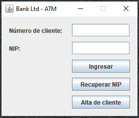
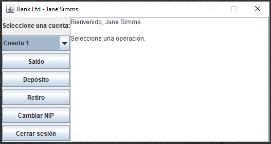
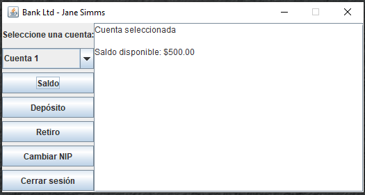
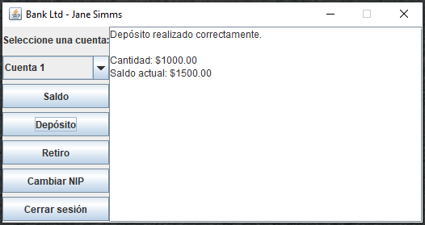
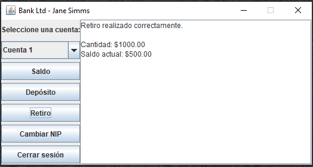
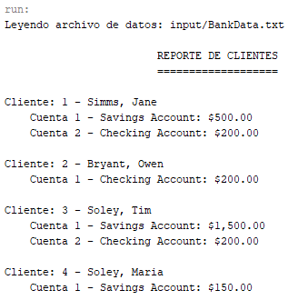

# Java-Banking-System-ATM
Java banking system with customer accounts, savings and checking accounts, overdraft protection, file-based data loading, customer reports, and a Swing-based ATM interface.
# ATM Banking System
A Java-based banking and ATM simulation developed using object-oriented programming principles. The project implements customer management, bank accounts, deposits, withdrawals, overdraft protection, customer authentication through a PIN, session management, customer registration, PIN recovery, data loading from a text file, customer reports, and a graphical ATM interface built with Java Swing.
## Description
This project simulates the basic operation of an Automated Teller Machine (ATM) connected to a simple banking system.
The application is organized into different packages according to their responsibilities:
- `banking.domain` contains the main banking entities and business rules.
- `banking.data` manages the loading of customer and account information.
- `banking.gui` contains the graphical ATM interface.
- `banking.reports` contains the customer reporting functionality.
The system allows customers to:
- Log in using a customer ID and PIN.
- Check their account balance.
- Make deposits.
- Make withdrawals.
- Use overdraft protection when available.
- End their current ATM session.
- Register new customers.
- Validate customer IDs and prevent duplicates.
- Recover or reset their PIN.
- Load customers and accounts from a data file.
- Generate a report containing customers and their accounts.
The project also includes custom exception handling for invalid customers, invalid PINs, duplicate customers, invalid accounts, insufficient funds, and other invalid banking operations.
## Technologies
- Java
- Java Swing
- Object-Oriented Programming
- Inheritance
- Polymorphism
- Encapsulation
- Exception Handling
- Collections
- File I/O
- `ArrayList`
- `ListIterator`
- `Scanner`
- Singleton Pattern
## Project Structure
```text
ATM-Banking-System/
│
├── src/
│   └── banking/
│       ├── data/
│       │   └── DataSource.java
│       │
│       ├── domain/
│       │   ├── Account.java
│       │   ├── Bank.java
│       │   ├── CheckingAccount.java
│       │   ├── Customer.java
│       │   ├── DuplicateCustomerException.java
│       │   ├── InvalidAccountException.java
│       │   ├── InvalidCustomerException.java
│       │   ├── InvalidPinException.java
│       │   ├── OverdraftException.java
│       │   └── SavingsAccount.java
│       │
│       ├── gui/
│       │   └── ATMClient.java
│       │
│       └── reports/
│           ├── CustomerReport.java
│           └── TestReport.java
│
├── input/
│   └── BankData.txt
│
├── assets/
│   └── images/
│       ├── atm_login.png
│       ├── atm_menu.png
│       ├── atm_balance.png
│       ├── atm_deposit.png
│       ├── atm_withdrawal.png
│       ├── atm_logout.png
│       ├── atm_register.png
│       ├── atm_pin_recovery.png
│       └── customer_report.png
│
└── README.md
```
## Package Organization
### `banking.domain`
This package contains the core classes that represent the banking system.
Main classes:
- `Bank`
- `Customer`
- `Account`
- `SavingsAccount`
- `CheckingAccount`
- `OverdraftException`
- Authentication and validation exceptions
`Account` represents the base account behavior.
`SavingsAccount` and `CheckingAccount` inherit from `Account` and provide specialized account functionality.
`CheckingAccount` additionally supports overdraft protection.
### `banking.data`
This package contains the classes responsible for loading banking information from an external file.
`DataSource` reads the contents of `BankData.txt` and creates the corresponding customers and accounts inside the bank.
### `banking.gui`
This package contains the graphical ATM application.
`ATMClient` creates and manages the Swing interface used by customers to interact with the banking system.
The interface handles authentication, banking operations, customer registration, PIN recovery, and session termination.
### `banking.reports`
This package contains the reporting functionality.
`CustomerReport` generates a report containing the customers registered in the bank and the accounts associated with them.
`TestReport` loads the data file and executes the report generation process.
## Banking Model
The project uses an object-oriented model to represent the relationship between the bank, customers, and accounts.
```text
Bank
 │
 ├── Customer
 │    │
 │    ├── SavingsAccount
 │    │
 │    └── CheckingAccount
 │
 ├── Customer
 │    │
 │    └── CheckingAccount
 │
 └── Customer
      │
      ├── SavingsAccount
      │
      └── CheckingAccount
```
The `Bank` maintains the registered customers.
Each `Customer` can have one or more accounts.
Each account derives from the common `Account` class.
## ATM Authentication
The ATM requires the customer to authenticate before accessing banking operations.
The authentication flow is:
```text
Start
  |
  v
Enter Customer ID
  |
  v
Validate Customer
  |
  +---- Invalid ----> Access Denied
  |
  v
Enter PIN
  |
  v
Validate PIN
  |
  +---- Invalid ----> Access Denied
  |
  v
ATM Main Menu
```
This prevents unauthorized access to customer accounts.
## PIN Management
The ATM uses a PIN as part of the customer authentication process.
Customers must provide the correct PIN before accessing their banking operations.
The system also includes a PIN recovery mechanism for situations in which the customer loses access to their account because they no longer remember their PIN.
The recovery process validates the customer information and allows the PIN to be recovered or reset according to the implemented application rules.
## ATM Operations
Once authentication is successful, the customer can access the ATM operations.
### Balance Inquiry
The customer can select the balance option to view the current balance of the account.
Example:
```text
Current balance: $1,000.00
```
### Deposit
The customer can enter an amount to deposit.
The system validates the amount and updates the account balance.
### Withdrawal
The customer can request a withdrawal.
The system checks whether the requested amount can be covered by the account balance.
For checking accounts, overdraft protection can also be considered when available.
### Overdraft Protection
Checking accounts can have an overdraft protection amount.
When the account balance is insufficient but the overdraft protection can cover the remaining amount, the transaction can be completed using the available protection.
If neither the account balance nor the overdraft protection is sufficient, an `OverdraftException` is generated.
### End Session
The ATM allows the customer to terminate the current session.
This is important because an authenticated account should not remain permanently accessible.
After ending the session, the application returns to the authentication stage.
## Customer Registration
The system supports the creation of new customers.
During registration, the system validates the customer identifier to prevent duplicate customers.
If the requested customer ID is already registered, a `DuplicateCustomerException` is used to reject the operation.
This helps maintain unique customer records within the banking system.
## PIN Recovery
The application provides a recovery mechanism for customers who forget their PIN.
The recovery process is intended to prevent the customer from becoming permanently locked out of the ATM.
The system validates the required customer information before allowing the PIN to be recovered or changed.
## Exception Handling
Custom exceptions are used to represent specific error conditions.
Examples include:
- `DuplicateCustomerException`
- `InvalidCustomerException`
- `InvalidPinException`
- `InvalidAccountException`
- `OverdraftException`
The exception handling system allows the application to provide meaningful feedback instead of failing unexpectedly.
Examples of situations handled include:
```text
Invalid customer
        |
        v
Access denied
Invalid PIN
        |
        v
Authentication rejected
Duplicate customer ID
        |
        v
Registration rejected
Insufficient funds
        |
        v
Withdrawal rejected
Insufficient funds + insufficient overdraft
        |
        v
OverdraftException
```
## Input Data
The banking information is stored in:
```text
input/BankData.txt
```
The file contains the customer and account information loaded by `DataSource`.
A basic example of the original banking data format is:
```text
4
Jane Simms 2
S 500.00 0.05
C 200.00 400.00
Owen Bryant 1
C 200.00 0.00
Tim Soley 2
S 1500.00 0.05
C 200.00 0.00
Maria Soley 1
S 150.00 0.05
```
The first value represents the number of customers.
Each customer contains:
```text
FirstName LastName NumberOfAccounts
```
Savings accounts use:
```text
S Balance InterestRate
```
Checking accounts use:
```text
C Balance OverdraftProtection
```
The current application may also require authentication information such as a customer ID and PIN depending on the implemented version of `Customer` and `DataSource`.
The important requirement is that `BankData.txt` must follow exactly the format expected by the current `DataSource` implementation.
## Running the Project
### Using NetBeans
1. Open the project in NetBeans.
2. Verify that `BankData.txt` exists inside the `input` directory.
3. Build the project.
4. Configure the main class as:
```text
banking.gui.ATMClient
```
5. Configure the program argument to point to:
```text
input/BankData.txt
```
6. Run the project.
The application should load the banking data and open the ATM interface.
### Running the ATM from the Command Line
From the compiled project environment, the ATM can be executed using:
```bash
java banking.gui.ATMClient input/BankData.txt
```
The exact command can vary depending on the Java compilation directory and classpath configuration.
### Running the Customer Report
The report can be executed using:
```bash
java banking.reports.TestReport input/BankData.txt
```
The report reads the same banking data file used by the ATM.
## Application Workflow
The complete application workflow can be summarized as follows:
```text
                 +----------------------+
                 |        START         |
                 +----------+-----------+
                            |
                            v
                 +----------------------+
                 | Load BankData.txt    |
                 +----------+-----------+
                            |
                            v
                 +----------------------+
                 |    ATM Login         |
                 +----------+-----------+
                            |
              +-------------+-------------+
              |                           |
              v                           v
       Register Customer           Recover PIN
              |                           |
              +-------------+-------------+
                            |
                            v
                 +----------------------+
                 | Enter Customer ID     |
                 +----------+-----------+
                            |
                            v
                 +----------------------+
                 | Enter PIN             |
                 +----------+-----------+
                            |
                 +----------+----------+
                 |                     |
              Invalid                 Valid
                 |                     |
                 v                     v
          Access Denied         ATM Main Menu
                                       |
                  +--------------------+--------------------+
                  |                    |                    |
                  v                    v                    v
                Balance             Deposit             Withdrawal
                  |                    |                    |
                  +--------------------+--------------------+
                                       |
                                       v
                                End Session
                                       |
                                       v
                                  ATM Login
```
## Customer Report
The reporting component generates information about the customers and their accounts.
A typical report follows this structure:
```text
            CUSTOMER REPORT
            ===============
Customer: Simms, Jane
    Savings Account: balance ...
    Checking Account: balance ...
Customer: Bryant, Owen
    Checking Account: balance ...
Customer: Soley, Tim
    Savings Account: balance ...
    Checking Account: balance ...
Customer: Soley, Maria
    Savings Account: balance ...
```
The report identifies each customer and the accounts associated with them.
## Screenshots
The repository includes screenshots demonstrating the main functionality of the application.
All screenshots should be stored inside:
```text
assets/images/
```
The README references them using relative paths so GitHub can display them automatically.
The final screenshot directory should contain:
```text
assets/
└── images/
    ├── atm_login.png
    ├── atm_menu.png
    ├── atm_balance.png
    ├── atm_deposit.png
    ├── atm_withdrawal.png
    ├── atm_logout.png
    ├── atm_register.png
    ├── atm_pin_recovery.png
    └── customer_report.png
```
### ATM Login
This screenshot shows the initial ATM authentication screen where the customer enters their identification information.

### ATM Main Menu
This screenshot shows the main ATM menu after the customer successfully authenticates.

### Balance Inquiry
This screenshot demonstrates a successful balance inquiry.

### Deposit
This screenshot demonstrates a deposit operation.

### Withdrawal
This screenshot demonstrates a withdrawal operation.

### End Session
This screenshot demonstrates the process of ending an authenticated ATM session.

### Customer Registration
This screenshot demonstrates the customer registration functionality.

### PIN Recovery
This screenshot demonstrates the PIN recovery functionality.

### Customer Report
This screenshot demonstrates the generated customer report.

## Object-Oriented Programming Concepts
This project demonstrates several object-oriented programming concepts.
### Encapsulation
Customer, account, and banking information are managed through classes and methods that control access to the internal data.
### Inheritance
`SavingsAccount` and `CheckingAccount` inherit from the base `Account` class.
```java
public class SavingsAccount extends Account
```
and:
```java
public class CheckingAccount extends Account
```
This allows both account types to reuse common account functionality.
### Polymorphism
The application can handle different account types through the common `Account` reference.
For example:
```java
Account account;
```
can reference either a `SavingsAccount` or a `CheckingAccount`.
### Exception Handling
Custom exceptions are used to represent invalid operations and make the program more robust.
### Collections
`ArrayList` is used to store customers and accounts.
Iterators are used to traverse these collections when generating reports and processing banking information.
### Singleton Pattern
The `Bank` class maintains a single shared instance through:
```java
Bank.getBank();
```
This allows the application to work with the same bank object throughout its execution.
## Validation
The system validates several situations that can occur during normal operation:
- Customer ID does not exist.
- PIN is incorrect.
- Customer ID is already registered.
- Account does not exist.
- Deposit amount is invalid.
- Withdrawal amount is invalid.
- Account balance is insufficient.
- Overdraft protection is insufficient.
- Data file cannot be found.
- Data file contains invalid information.
- Required program arguments are missing.
- ATM session is terminated correctly.
## Main Classes
| Class | Responsibility |
|---|---|
| `Bank` | Maintains the registered customers |
| `Customer` | Represents a customer and their accounts |
| `Account` | Base class for bank accounts |
| `SavingsAccount` | Represents a savings account |
| `CheckingAccount` | Represents a checking account with overdraft protection |
| `OverdraftException` | Handles insufficient-funds situations |
| `DataSource` | Loads banking data from the input file |
| `ATMClient` | Provides the graphical ATM interface |
| `CustomerReport` | Generates the customer report |
| `TestReport` | Executes the report generation |
## Project Goals
The main goals of this project are:
1. Practice object-oriented programming in Java.
2. Implement inheritance and polymorphism.
3. Work with Java collections.
4. Implement custom exception handling.
5. Process structured information from external files.
6. Build a graphical interface using Java Swing.
7. Simulate a real-world banking workflow.
8. Implement customer authentication.
9. Manage ATM sessions correctly.
10. Implement customer registration.
11. Implement PIN recovery.
12. Validate customer and account operations.
13. Generate reports from banking data.
## Important Notes
This project is an academic banking simulation.
It is not intended to represent a production banking system or process real financial information.
The PIN and authentication mechanisms are implemented for educational purposes. A production banking application would require stronger security measures such as encrypted credential storage, secure authentication protocols, multi-factor authentication, database persistence, secure session management, audit logging, and additional protection against unauthorized access.
## Author
**Luis Alva**
Java academic project focused on object-oriented programming, banking-domain modeling, exception handling, file processing, authentication, customer management, reporting, and graphical user interfaces.
