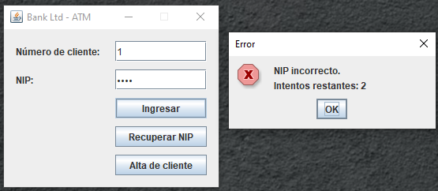
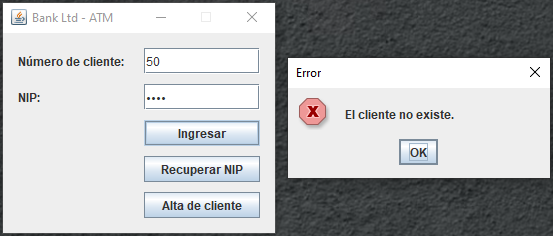
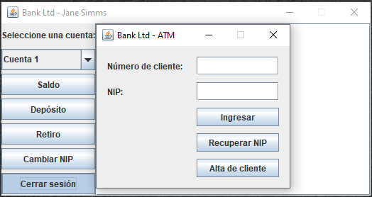

# ATM Banking System

A Java-based ATM banking application developed to practice object-oriented programming, exception handling, file-based data loading, account management, and graphical user interfaces with Swing.

The project simulates a basic banking system where customers can access their accounts through an ATM interface using a customer number and PIN. The application supports deposits, withdrawals, balance inquiries, customer management, overdraft protection, PIN validation, and customer reports.

---

## Description

This project implements a small banking system divided into several packages according to their responsibilities.

The application loads customer and account information from a text file, creates the corresponding banking objects, and provides an ATM graphical interface for customers.

The system also includes validation and exception handling for situations such as:

* Invalid customer numbers.
* Invalid PINs.
* Non-existent customers.
* Duplicate customers.
* Invalid customer information.
* Invalid or malformed data files.
* Insufficient account funds.
* Insufficient funds even when overdraft protection is available.
* Invalid banking operations.

The project also includes a customer report that displays the customers registered in the system and their associated accounts.

---

## Main Features

### ATM authentication

Customers must enter:

1. Customer number.
2. PIN.

The system validates both pieces of information before granting access to the ATM operations.

### Balance inquiry

The customer can check the current balance of the selected account.

### Deposits

The customer can enter an amount and deposit it into the account.

### Withdrawals

The system validates whether the customer has enough funds to complete the withdrawal.

Checking accounts can additionally use overdraft protection when configured.

### Session termination

The ATM provides an option to terminate the current customer session.

This prevents a customer session from remaining active indefinitely and allows another customer to authenticate afterward.

### Customer management

The banking system supports customer registration and validates that:

* The customer number is valid.
* The customer number is not already in use.
* The customer information is valid.
* Duplicate customers are rejected.

### PIN validation

Each customer has a PIN associated with their account.

The ATM verifies the PIN during authentication and rejects invalid credentials.

### Customer report

The project includes a report generator that displays the registered customers and their accounts, including account type and current balance.

### File-based data loading

Customer and account information is loaded from a text file.

The default data file is:

```text
input/BankData.txt
```

---

## Technologies

* Java
* Java Swing
* Object-Oriented Programming
* Java Collections
* Java Exceptions
* File I/O
* `Scanner`
* `ArrayList`
* `ListIterator`
* Inheritance
* Polymorphism
* Encapsulation
* Singleton pattern

---

## Project Structure

The repository should be organized as follows:

```text
ATM-Banking-System/
│
├── src/
│   └── banking/
│       │
│       ├── data/
│       │   └── DataSource.java
│       │
│       ├── domain/
│       │   ├── Account.java
│       │   ├── Bank.java
│       │   ├── CheckingAccount.java
│       │   ├── Customer.java
│       │   ├── CustomerNotFoundException.java
│       │   ├── DataFormatException.java
│       │   ├── DuplicateCustomerException.java
│       │   ├── InvalidCustomerException.java
│       │   ├── InvalidPinException.java
│       │   ├── OverdraftException.java
│       │   └── SavingsAccount.java
│       │
│       ├── gui/
│       │   └── ATMClient.java
│       │
│       └── reports/
│           ├── CustomerReport.java
│           └── TestReport.java
│
├── input/
│   └── BankData.txt
│
├── assets/
│   └── images/
│       ├── atm_login.png
│       ├── atm_menu.png
│       ├── atm_balance.png
│       ├── atm_deposit.png
│       ├── atm_withdrawal.png
│       ├── atm_invalid_pin.png
│       ├── atm_invalid_customer.png
│       ├── atm_session_end.png
│       └── customer_report.png
│
└── README.md
```

> If the project is being managed with NetBeans, the generated NetBeans folders such as `nbproject/`, `build/`, and `dist/` may also appear in the repository depending on the project configuration.

---

## Package Organization

### `banking.data`

Contains the classes responsible for loading banking information from external files.

#### `DataSource.java`

Reads `BankData.txt`, validates the data format, and creates customers and their corresponding accounts.

---

### `banking.domain`

Contains the main entities and business rules of the banking system.

The package contains the following classes:

#### `Account.java`

Base class for bank accounts.

Provides common operations such as:

* Checking balance.
* Depositing money.
* Withdrawing money.

#### `Bank.java`

Represents the central banking system.

Maintains the collection of registered customers and provides operations for retrieving and managing them.

#### `CheckingAccount.java`

Represents a checking account.

Extends `Account` and implements overdraft protection.

#### `Customer.java`

Represents a bank customer.

Stores customer information, authentication information, and associated accounts.

#### `CustomerNotFoundException.java`

Exception used when the requested customer does not exist in the banking system.

#### `DataFormatException.java`

Exception used when the information contained in the banking data file does not follow the expected format.

#### `DuplicateCustomerException.java`

Exception used when an attempt is made to register a customer that already exists.

#### `InvalidCustomerException.java`

Exception used when the customer information is invalid.

#### `InvalidPinException.java`

Exception used when the PIN supplied during authentication is invalid.

#### `OverdraftException.java`

Exception used when an account does not have sufficient funds to complete a withdrawal.

The exception can also provide information about the remaining deficit.

#### `SavingsAccount.java`

Represents a savings account.

Extends `Account` and stores the account's interest rate.

---

### `banking.gui`

Contains the graphical ATM application.

#### `ATMClient.java`

Provides the Swing-based ATM interface.

The interface allows the customer to:

* Authenticate.
* Check balance.
* Make deposits.
* Make withdrawals.
* End the current session.

---

### `banking.reports`

Contains the classes responsible for generating customer information reports.

#### `CustomerReport.java`

Generates a report containing registered customers and their accounts.

#### `TestReport.java`

Entry point used to load the banking data and generate the customer report.

---

## Input Data

The banking system uses a text file to initialize customers and accounts.

The recommended location is:

```text
input/BankData.txt
```

Example:

```text
4
Jane Simms 2
S 500.00 0.05
C 200.00 400.00
Owen Bryant 1
C 200.00 0.00
Tim Soley 2
S 1500.00 0.05
C 200.00 0.00
Maria Soley 1
S 150.00 0.05
```

The first value represents the number of customers.

Each customer entry contains the customer's information followed by the number of accounts.

For savings accounts:

```text
S balance interestRate
```

For checking accounts:

```text
C balance overdraftProtection
```

The exact customer authentication information, including customer number and PIN, must follow the format implemented by the current `Customer` and `DataSource` classes.

---

## Running the Application

### From NetBeans

Open the project in NetBeans and make sure the project structure contains:

```text
src/
input/
```

The `BankData.txt` file must be available at:

```text
input/BankData.txt
```

Run:

```text
ATMClient
```

If the project is configured with `ATMClient` as the main class, simply use:

```text
Run Project
```

---

## Running ATMClient from the Command Line

The ATM application expects the path to the data file as its argument.

Example:

```bash
java banking.gui.ATMClient input/BankData.txt
```

If no argument is supplied, the program displays the expected usage.

The argument is necessary because the application needs to know where the banking data is stored.

---

## Running the Customer Report

The report also requires the path to the banking data file.

Example:

```bash
java banking.reports.TestReport input/BankData.txt
```

The program loads the data and generates a report similar to:

```text
REPORTE DE CLIENTES
===================

Cliente: Simms, Jane
    Savings Account: su saldo es de $500.00
    Checking Account: su saldo es de $200.00

Cliente: Bryant, Owen
    Checking Account: su saldo es de $200.00
```

---

## ATM Authentication

The normal flow of the application is:

```text
Start ATM
   │
   ▼
Enter Customer Number
   │
   ▼
Enter PIN
   │
   ├── Invalid Customer ──► Error
   │
   ├── Invalid PIN ────────► Error
   │
   ▼
ATM Main Menu
   │
   ├── Balance
   │
   ├── Deposit
   │
   ├── Withdrawal
   │
   └── End Session
```

The customer must authenticate before performing banking operations.

---

## Account Operations

### Balance

The ATM displays the current account balance.

### Deposit

The customer enters the amount to deposit.

The amount is validated before modifying the account balance.

### Withdrawal

The ATM verifies that the requested amount can be withdrawn.

For checking accounts, the system may use overdraft protection if available.

If the available funds and overdraft protection are insufficient, an `OverdraftException` is generated.

---

## Exception Handling

The project uses specific exceptions to make errors easier to identify and manage.

| Exception                    | Purpose                            |
| ---------------------------- | ---------------------------------- |
| `CustomerNotFoundException`  | Customer does not exist            |
| `DataFormatException`        | Input file contains invalid data   |
| `DuplicateCustomerException` | Customer already exists            |
| `InvalidCustomerException`   | Customer information is invalid    |
| `InvalidPinException`        | Authentication PIN is invalid      |
| `OverdraftException`         | Withdrawal exceeds available funds |

This approach prevents all errors from being handled as generic exceptions and makes the banking logic easier to maintain.

---

## Customer Registration

When a new customer is registered, the system validates the information before adding the customer to the bank.

The system should reject:

* Duplicate customer numbers.
* Invalid customer information.
* Invalid PIN values.
* Incomplete customer data.

This prevents inconsistent customer records from being introduced into the banking system.

---

## Session Management

After authentication, a customer can perform multiple operations.

The session is not intended to remain active indefinitely.

The customer can select the option to end the session.

The application then returns to the authentication stage so another customer can use the ATM.

```text
Authenticated Customer
        │
        ▼
    ATM Menu
        │
   ┌────┼────┬─────────┐
   ▼    ▼    ▼         ▼
Balance Deposit Withdrawal End Session
                         │
                         ▼
                  Authentication
```

---

## Screenshots

The repository should contain screenshots demonstrating the main functionality of the ATM.

Store all screenshots in:

```text
assets/images/
```

Recommended screenshots:

### 1. ATM Login

Show the initial authentication screen where the customer enters:

* Customer number.
* PIN.

File:

```text
assets/images/atm_login.png
```

README usage:

```markdown

```

### 2. ATM Main Menu

Show the interface after successful authentication.

The screenshot should demonstrate that the customer has access to the available banking operations.

File:

```text
assets/images/atm_menu.png
```

README usage:

```markdown

```

### 3. Balance Inquiry

Show the result of selecting the balance option.

File:

```text
assets/images/atm_balance.png
```

README usage:

```markdown

```

### 4. Deposit

Show a successful deposit operation.

File:

```text
assets/images/atm_deposit.png
```

README usage:

```markdown

```

### 5. Withdrawal

Show a successful withdrawal operation.

File:

```text
assets/images/atm_withdrawal.png
```

README usage:

```markdown

```

### 6. Invalid PIN

Show the error displayed when an incorrect PIN is entered.

File:

```text
assets/images/atm_invalid_pin.png
```

README usage:

```markdown

```

### 7. Invalid Customer

Show the error displayed when a customer number that does not exist is entered.

File:

```text
assets/images/atm_invalid_customer.png
```

README usage:

```markdown

```

### 8. Session Termination

Show the result of ending the current customer session and returning to the authentication screen.

File:

```text
assets/images/atm_session_end.png
```

README usage:

```markdown

```

### 9. Customer Report

Show the console output generated by `CustomerReport`.

File:

```text
assets/images/customer_report.png
```

README usage:

```markdown

```

---

## Screenshot Organization

The recommended repository structure for screenshots is:

```text
assets/
└── images/
    ├── atm_login.png
    ├── atm_menu.png
    ├── atm_balance.png
    ├── atm_deposit.png
    ├── atm_withdrawal.png
    ├── atm_invalid_pin.png
    ├── atm_invalid_customer.png
    ├── atm_session_end.png
    └── customer_report.png
```

The screenshots should be real captures of the application rather than manually recreated images.

This allows the repository to demonstrate that the implemented functionality actually works.

---

## Recommended README Screenshot Section

After adding the images to the repository, the screenshots can be displayed together using:

```markdown
## Screenshots

### ATM Login


### ATM Main Menu


### Balance Inquiry


### Deposit


### Withdrawal


### Invalid PIN


### Invalid Customer


### Session Termination


### Customer Report


```

---

## Concepts Practiced

This project demonstrates several important Java programming concepts:

* Classes and objects.
* Encapsulation.
* Inheritance.
* Polymorphism.
* Static members.
* Collections.
* Iterators.
* File reading.
* Exception handling.
* Custom exceptions.
* GUI development with Swing.
* Event handling.
* Input validation.
* Account management.
* Authentication.
* Session management.
* Basic banking business rules.

---

## Project Architecture

The project follows a basic separation of responsibilities:

```text
                 ┌─────────────────────┐
                 │      ATMClient      │
                 │    banking.gui      │
                 └──────────┬──────────┘
                            │
                            ▼
                 ┌─────────────────────┐
                 │        Bank         │
                 │   banking.domain    │
                 └──────────┬──────────┘
                            │
              ┌─────────────┼─────────────┐
              ▼             ▼             ▼
         Customer       Accounts      Exceptions
                            │
                    ┌───────┴────────┐
                    ▼                ▼
             SavingsAccount    CheckingAccount
                            │
                            ▼
                     DataSource
                            │
                            ▼
                    BankData.txt
```

---

## Important Notes

The `BankData.txt` file is required for loading the initial banking information.

The application should be executed from a configuration where the relative path:

```text
input/BankData.txt
```

can be resolved correctly.

If the program is executed from a different working directory, provide the corresponding path explicitly.

For example:

```bash
java banking.gui.ATMClient ./input/BankData.txt
```

or:

```bash
java banking.reports.TestReport ./input/BankData.txt
```

---

## Repository Structure Summary

The final repository should contain at least:

```text
ATM-Banking-System/
│
├── src/
│   └── banking/
│       ├── data/
│       │   └── DataSource.java
│       │
│       ├── domain/
│       │   ├── Account.java
│       │   ├── Bank.java
│       │   ├── CheckingAccount.java
│       │   ├── Customer.java
│       │   ├── CustomerNotFoundException.java
│       │   ├── DataFormatException.java
│       │   ├── DuplicateCustomerException.java
│       │   ├── InvalidCustomerException.java
│       │   ├── InvalidPinException.java
│       │   ├── OverdraftException.java
│       │   └── SavingsAccount.java
│       │
│       ├── gui/
│       │   └── ATMClient.java
│       │
│       └── reports/
│           ├── CustomerReport.java
│           └── TestReport.java
│
├── input/
│   └── BankData.txt
│
├── assets/
│   └── images/
│       ├── atm_login.png
│       ├── atm_menu.png
│       ├── atm_balance.png
│       ├── atm_deposit.png
│       ├── atm_withdrawal.png
│       ├── atm_invalid_pin.png
│       ├── atm_invalid_customer.png
│       ├── atm_session_end.png
│       └── customer_report.png
│
└── README.md
```

---

## Author

**Luis Alva**

Java banking application developed as an programming project focused on object-oriented programming, exception handling, file processing, and graphical user interfaces.
